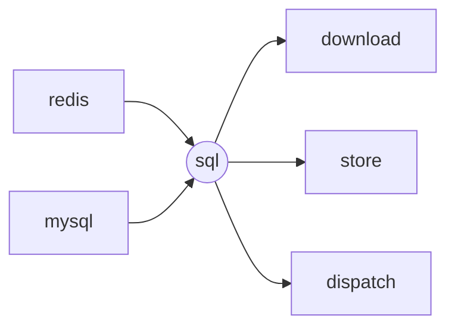
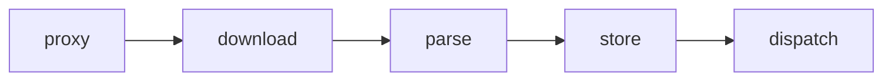

# spider-backend

- base



- main



```
REDIS_IP: redis
REDIS_PORT: redis
MYSQL_IP: mysql
MYSQL_PORT: mysql
SQL_PORT: 10010

SPIDER: spider_backend
PROXY_PORT: 10011
DOWNLOAD_PORT: 10012
PARSE_PORT: 10013
STORE_PORT: 10014
DISPATCH_PORT: 10015
```